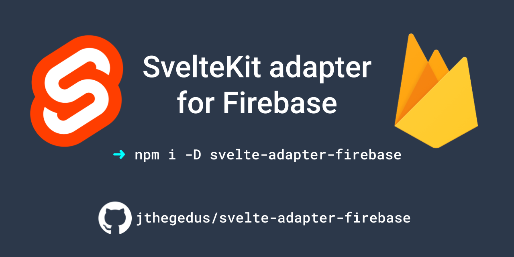

<div align="center">

<!-- TODO: on 1.0.0 release, delete this section -->

| :warning: WARNING: this project is considered to be in BETA until SvelteKit is available for general use and the Adapter API is stable! |
| --------------------------------------------------------------------------------------------------------------------------------------- |

<!-- END -->



# svelte-adapter-firebase

[](https://github.com/jthegedus/svelte-adapter-firebase/releases)
[](https://www.npmjs.com/package/svelte-adapter-firebase)
[](https://github.com/jthegedus/svelte-adapter-firebase/actions/workflows/test.yaml)
[](https://github.com/jthegedus/svelte-adapter-firebase/actions/workflows/codeql-analysis.yaml)

[Firebase](https://firebase.google.com/) adapter for
[SvelteKit](https://github.com/sveltejs/kit).

Utilise the Firebase Hosting CDN with dynamic content served by SvelteKit on
Cloud Functions!

:heavy_check_mark: SSR on
[Cloud Functions](https://firebase.google.com/docs/hosting/functions)</br>
:heavy_check_mark: Integrates with existing Cloud Functions!</br>
:heavy_check_mark: Local production testing with
[Firebase Emulator](https://firebase.google.com/docs/emulator-suite)</br>
:heavy_check_mark: Mitigate cold-starts with
[minInstances](https://firebase.google.com/docs/functions/manage-functions#min-max-instances)</br>
:heavy_check_mark:
[Multiple Hosting Sites](https://firebase.google.com/docs/hosting/multisites#add_additional_sites)</br>

</div>

## Contents

- [Setup](#setup)
  - [Beta Adapter Version Compatibility](#beta-adapter-version-compatibility)
- [Configuration Overview](#configuration-overview)
- [Details](#details)
  - [`firebase.json` Configurations](#firebasejson-configurations)
  - [Adapter Configurations](#adapter-configurations)
- [How it works](#how-it-works)
- [Firebase Emulator local Testing](#cloud-function-firebase-emulator-local-testing)
- [Deployment](#deployment)
- [Caveats](#caveats)
- [Non-Goals](#non-goals)
- [FAQ](#faq)
- [Contributing](#contributing)

## Setup

The adapter reads `firebase.json` to determine output dirs for Server scripts &
Static assets, without this file the adapter cannot know how your Firebase app
is configured. Hosting & Cloud Functions are required.

In your standard SvelteKit project:

- `npm install --save-dev svelte-adapter-firebase`
- add adapter to `svelte.config.js`:

```diff
+import firebase from "svelte-adapter-firebase";

/** @type {import('@sveltejs/kit').Config} */
export default {
  kit: {
+   adapter: firebase(),
    target: "#svelte",
  },
};
```

- Setup `firebase.json` with `firebase init`.
- `npm run build`. **Read and repeat, the output is meant as a guide. IE: after
  your first build, you need to manually add the produced Cloud Function in
  `index.js`**

<!-- TODO: on 1.0.0 release, delete this section -->

### Beta Adapter Version Compatibility

SvelteKit is still in Beta and the Adapter API is in flux, this can result in
the Adapter and SvelteKit becoming incompatible. Here is a compatibility table:

| Adapter Version | SvelteKit Version    |
| --------------- | -------------------- |
| `0.13.1`        | `1.0.0-next.180`     |
| `0.13.0`        | `1.0.0-next.168`     |
| `0.12.x`        | `1.0.0-next.165`     |
| `0.11.x`        | `1.0.0-next.155`     |
| `NA`            | `1.0.0-next.152-154` |
| `0.10.x`        | `1.0.0-next.132`     |
| `0.9.1`         | `1.0.0-next.122`     |
| `0.9.0`         | `1.0.0-next.120`     |
| `0.8.x`         | `1.0.0-next.111`     |
| `NA`            | `1.0.0-next.109-110` |
| `0.7.x`         | `1.0.0-next.107`     |
| `0.6.x`         | `1.0.0-next.103`     |
| `0.5.x`         | `1.0.0-next.54`      |
| `0.4.x`         | `1.0.0-next.46`      |
| `0.3.x`         | `1.0.0-next.27`      |

**Note**: only the versions listed have been tested together, if others happen
to work, it is just coincidence. This is beta software after all.

<!-- END -->

## Configuration Overview

Adapter options:

- `esbuildBuildOptions`
  - function to return an `esbuild.BuildOptions` object
  - default: see `defaultOptions` object in [`src/index.js`](./src/index.js)
- `firebaseJsonPath`
  - path to your `firebase.json` file, **relative** from where `svelte build` is
    called
  - default: `./firebase.json`
- `target`
  - required when `firebase.json:hosting` is an array (contains many site
    configurations)
  - default: `undefined`
- `sourceRewriteMatch`
  - used to lookup the rewrite config to determine whether to output SSR code
    for Cloud Functions. See
    [Firebase Rewrite configuration docs](https://firebase.google.com/docs/hosting/full-config#rewrite-functions).
  - default: `**`

Adapter output:

- static assets (images, CSS, Client-side JavaScript) of your SvelteKit app
  output to the directory defined by `firebase.json:hosting.public`
- server assets (SSR JavaScript) output alongside your Cloud Functions defined
  by `firebase.json:functions.source`

## Details

[Setup](#setup) outlines the steps most commonly used with a single SvelteKit
app. Here we go into the details of each configuration and how it interacts with
the `firebase.json` config.

The 3 step process is:

1. select Hosting config from `firebase.json`. If more than one site present in
   config, match `svelte.config.js:target` field with either
   `firebase.json:hosting[].site` or `.target` fields.
2. output static assets to the directory in the `public` field
3. identify the rewrite rule for SSR to determine Cloud Function output. The
   rewrite rule is determined by a lookup of the `rewrites.source` against
   `sourceRewriteMatch`

### `firebase.json` Configurations

Due to the relaxed rules of `firebase.json` we can have many valid configs. At a
minimum, one or more Hosting sites is required with an associated Functions
config if a Cloud Function rewrite is used. These are the combintations:

<details>
<summary>single Hosting site with Cloud Function rewrite</summary>

```json
{
  "hosting": {
    "public": "<someDir>",
    "rewrites": [
      {
        "source": "**",
        "function": "<functionName>"
      }
    ]
  },
  "functions": {
    "source": "<anotherDir>"
  }
}
```

</details>

<details>
<summary>multiple Hosting site with Cloud Function rewrite</summary>

```json
{
  "hosting": [
    {
      "site": "blog",
      "public": "<someDir>",
      "rewrites": [
        {
          "source": "**",
          "function": "<functionName>"
        }
      ]
    },
    {
      // another site config
    }
  ],
  "functions": {
    "source": "<anotherDir>"
  }
}
```

To correctly lookup the `blog` site, `target` will need to be set in
`svelte.config.js`:

```js
import firebase from "svelte-adapter-firebase";

/** @type {import('@sveltejs/kit').Config} */
export default {
  kit: {
    adapter: firebase({ target: "blog" }),
    target: "#svelte",
  },
};
```

</details>

### Adapter Configurations

Detailed examples of the adapter configuration options.

All options:

```js
import firebase from "svelte-adapter-firebase";

/** @type {import('@sveltejs/kit').Config} */
export default {
  kit: {
    adapter: firebase({
      esbuildBuildOptions: (defaultOptions: BuildOptions) => Promise<BuildOptions> | BuildOptions,
      firebaseJsonPath: "",
      target: "",
      sourceRewriteMatch: "",
    }),
    target: "#svelte",
  },
};
```

<details>
<summary><code>esbuildBuildOptions</code></summary>

As an escape hatch, you may optionally specify a function which will receive the
final esbuild options generated by this adapter and returns a modified esbuild
configuration. The result of this function will be passed as-is to esbuild. The
function can be async.

For example, you may wish to add `plugins`, or configure the
[`format`](https://esbuild.github.io/api/#format) to bundle to ESM (defaults to
CJS):

```js
import firebase from "svelte-adapter-firebase";

/** @type {import('@sveltejs/kit').Config} */
export default {
  kit: {
    adapter: firebase({
      esbuildBuildOptions(defaultOptions) {
        return {
          ...defaultOptions,
          target: "esm"
          plugins: [],
        };
      },
    }),
    target: "#svelte",
  },
};
```

The default options for this version are as follows:

```js
{
	entryPoints: ['.svelte-kit/firebase/handler.js'],
	outfile: `pathToOutputDir/index.js`,
	bundle: true,
	inject: ['pathTo/shims.js'],
	platform: 'node',
  target: `node${functionRuntimeVersion}`
}
```

where esbuild `target` is computed from the Node.js runtime version defined for
your Cloud Functions.

</details>

<details>
<summary><code>firebaseJsonPath</code></summary>

If the `firebase.json` file is not in the directory you run `svelte build`, then
you can set a relative path in `svelte.config.js`:

```
.gitignore
firebase.json
app/                    <-- svelte build run in this dir
	package.json
	svelte.config.js
	src/
anotherApp/
	index.html
	index.css
functions/
	package.json
	index.js
```

```js
import firebase from "svelte-adapter-firebase";

/** @type {import('@sveltejs/kit').Config} */
export default {
  kit: {
    adapter: firebase({ firebaseJsonPath: "../firebase.json" }),
    target: "#svelte",
  },
};
```

</details>

<details>
<summary><code>target</code></summary>

If `firebase.json:hosting` is an array of sites, then each hosting config must
list a `site` or `target` field that matches the adatper's `target` option. For
example:

```json
// firebase.json
{
  "hosting": [
    {
      "site": "blog",
      // or
      // "target": "blog",
      "public": "<someDir>",
      "rewrites": [
        {
          "source": "**",
          "run": {
            "serviceId": "<cloudRunServiceId>"
          }
        }
      ]
    },
    {
      "site": "adminPanel",
      // or
      // "target": "adminPanel",
      "public": "<anotherDir>"
    }
  ]
}
```

```js
import firebase from "svelte-adapter-firebase";

/** @type {import('@sveltejs/kit').Config} */
export default {
  kit: {
    adapter: firebase({ target: "blog" }),
    target: "#svelte",
  },
};
```

The Firebase config & adapter config match (`firebase.json:hosting[0].site` ===
adapter `target`), so therefore we know which Firebase Hosting site you want to
build the SvelteKit site for.

</details>

<details>
<summary><code>sourceRewriteMatch</code></summary>

If the rewrite `source` pattern is not `**`, then `svelte.config.js`
`sourceRewriteMatch` will need to be set to match your desired rewrite rule. For
example:

```json
// firebase.json
{
  "hosting": {
    "public": "<someDir>",
    "rewrites": [
      {
        "source": "/blog/**",
        "run": {
          "serviceId": "<cloudRunServiceId>"
        }
      }
    ]
  }
}
```

```js
import firebase from "svelte-adapter-firebase";

/** @type {import('@sveltejs/kit').Config} */
export default {
  kit: {
    adapter: firebase({ sourceRewriteMatch: "/blog/**" }),
    target: "#svelte",
  },
};
```

</details>

## How it works

Given

- the following `firebase.json` configuration
- a standard SvelteKit app structure
- the default `svelte-adapter-firebase` config

```json
// firebase.json
{
  "hosting": {
    "public": "myApp",
    "rewrites": [
      {
        "source": "**",
        "function": "ssrServer"
      }
    ],
    "predeploy": ["npm run build"]
  },
  "functions": {
    "source": "functions"
  }
}
```

the following Server & Static assets dirs are created:

```
firebase.json ("public": "myApp")
package.json
svelte.config.js
src/
	app.html
	routes/
		index.svelte
functions/
	package.json ("main": "index.js")
	index.js
	sveltekit/		<-- Server Assets dir (code to be imported to you Cloud Function)
myApp/				<-- Static Assets to go to Firebase Hosting CDN
```

- `firebase.json:functions.source` dir is used to find `functions/package.json`
  whose `main` field is used to find the Cloud Function build dir. This is used
  as the server asset output dir.

<details>
  <summary>TypeScript Cloud Functions</summary>

Because we use the above method to determine the output dir, the server assets
are output to the correct place when using TypeScript.

```
firebase.json ("public": "myApp")
package.json
svelte.config.js
src/
  app.html
  routes/
    index.svelte
functions/
  package.json ("main": "lib/index.js")
  index.ts
  lib/
    index.js
    sveltekit/	<-- Server assets output to functions/lib
myApp/				<-- Static assets to go to Firebase Hosting CDN
```

</details>

<details>
<summary>Output with Multiple Sites</summary>

In a multi-site setup, the `site` or `target` field from hosting config in
`firebase.json` is used as the server output dir:

```
firebase.json ("site": "myCoolSite","public": "myApp")
package.json
svelte.config.js
src/
	app.html
	routes/
		index.svelte
functions/
	package.json
	index.js
	myCoolSite/		<-- Server assets
myApp/				<-- Static assets to go to Firebase Hosting CDN
```

</details>

The final piece is to write the actual Cloud Function source code to reference
the output server assets. The code is printed during `svelte build` and should
be placed in your `index.js` or `index.ts` manually.

This is a flexible solution that allows integrating with other Cloud Functions
in your project. You can edit the provided code as you see fit. The
import/require of the generated code will not change unless you change the
`firebase.json:hosting.site` or `package.json:main` fields, so you shouldn't
need to update this code after adding it.

## Cloud Function Firebase Emulator local Testing

Test your production build locally before pushing to git or deploying!

- build your app: `svelte-kit build`
- install Function dependencies: `pnpm install --prefix functions`
- start the emulator: `firebase emulators:start`

## Deployment

`firebase deploy` :tada:

## Caveats

- Using `firebase.json:hosting[].site` is preferred to
  `firebase.json:hosting[].target` as
  [Firebase Deploy Targets](https://firebase.google.com/docs/cli/targets) only
  supports Hosting, Storage & Databases and not Functions. This means you can
  use Deploy targets `target` field to identify your site for the adapter to
  **build**, but you **CANNOT use Deploy Targes when deploying** as you need to
  deploy the Hosting _& Functions_ at the same time for this solution to work as
  expected.
- [Firebase Hosting Preview Channels](https://firebase.google.com/docs/hosting/test-preview-deploy)
  currently lacks first-party support for SSR applications. This adapter doesn't
  attempt to remedy this issue and doesn't produce a different SSR Function for
  preview channel deployments.
- :warning: Cloud Function rewrites only support **us-central1**, other regions
  will error. The official warning about this can be found in
  [these docs](https://firebase.google.com/docs/hosting/functions).

## Non-goals

> Write Cloud Function code directly into `.js` file instead of printing in
> console.

Firebase Cloud Functions have a long history of people configuring their index
files completely differently, some even generating them from directories.
Accommodating these would be a headache. Instead, all we look for is a match
against this string, `${name} =`, where `name` is your Cloud Functions name. We
may make this configurable to a specific file in future.

Additionally, this allows for users to customise their Firebase Cloud Function
API like `runWith()` options for memory/CPU, min/max Instances and
VPC/Ingress/Egress configuration settings, without complex support for options
in the adapter. This keeps the Function config where it should, close to the
userland code.

> Handle the deployment of the app to Firebase.

Firebase apps consist of many different services with the CLI providing optional
deployments. We do not want to dictate full deployments with your frontend nor
perform partial deployments if it does not fit your app. The only option then is
to leave it to you :tada:

## FAQ

> Why is the Cloud Function code output to the terminal for me to add manually
> instead of being written to `functions/index.js`?

See [non-goals](#non-goals) _Write Cloud Function code directly into `.js` file
instead of printing in console._

> Firebase libs in SvelteKit

As recommended in the [SvelteKit FAQ](https://kit.svelte.dev/faq), please use
[Firebase JS SDK v9](https://firebase.google.com/docs/web/learn-more#modular-version)
as the older version of the SDK has issues and a larger bundle size.

> Cold Starts

Since the purpose of using this adapter is to leverage the Firebase Hosting CDN,
you should consider improving the user experience with targetted caching/TTLs.

If cold start are still an issue for your application, Cloud Functions has
support for `minInstances` which will keep `X` number of instances warm. From
the docs:

> A minimum number of instances kept running incur billing costs at idle rates.
> Typically, to keep one idle function instance warm costs less than $6.00 a
> month. The Firebase CLI provides a cost estimate at deployment time for
> functions with reserved minimum instances. Refer to Cloud Functions Pricing to
> calculate costs.
>
> -[Firebase docs](https://firebase.google.com/docs/functions/manage-functions#min-max-instances)

To implement this, configure your
[`runWith`](https://github.com/firebase/firebase-functions/blob/d46ec6191e61f560f3f21f13333e0f3285d3de90/src/function-configuration.ts#L101)
options like so:

```diff
const myRuntimeOptions = {
	memory: "1GB",
+	minInstances: 1,
}
exports.myFunc = functions.runWith(myRuntimeOptions).https.onRequest(async (request, response) => {
	...
});
```

Note: this is still single concurrency (if an instance does not exist to handle
a request when it hits the backend a new Function instance is created). Watch
this space!

<!-- TODO: on 1.0.0 release, delete this section -->

- `1.0.0` will not be published until the SvelteKit Adapter API is declared
  stable and SvelteKit is released for general use.

<!-- END -->

## Contributing

[Contributions of any kind welcome, just follow the
guidelines](CONTRIBUTING.md)!

Short version:

```
git clone https://github.com/jthegedus/svelte-adapter-firebase.git
asdf install
pnpm i
```

See [asdf](https://asdf-vm.com) to install set it up.

### external contributions

While building this adapter some issues were found with upstream components,
these are captured here should someone wish to contribute them:

- Cloud Function validation code linked in `utils.js` is from two different
  sources which indicates that it is being validated by `firebase-tools` in two
  separate places. PR a fix there.
