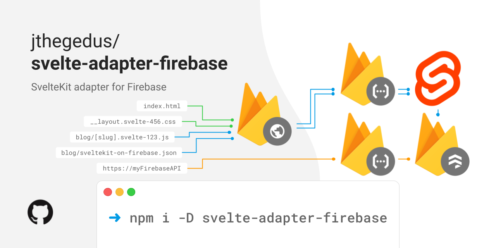

<div align="center">

| :warning: WARNING: this project is considered to be in ALPHA until SvelteKit is available for general use and the Adapter API is stable! |
| ---------------------------------------------------------------------------------------------------------------------------------------- |



# svelte-adapter-firebase

<!-- TODO: GitHub Actions badges, NPM badges/links -->

[](https://github.com/jthegedus/svelte-adapter-firebase/releases) [](https://www.npmjs.com/package/svelte-adapter-firebase) [](https://github.com/jthegedus/svelte-adapter-firebase/actions/workflows/test.yaml) [](https://github.com/jthegedus/svelte-adapter-firebase/actions/workflows/codeql-analysis.yml)

[Firebase](https://firebase.google.com/) adapter for [SvelteKit](https://github.com/sveltejs/kit). Supports:

:heavy_check_mark: SSR on [Cloud Run](https://firebase.google.com/docs/hosting/cloud-run) :information_source: recommended</br>
:heavy_check_mark: [Multiple Hosting Sites](https://firebase.google.com/docs/hosting/multisites#add_additional_sites)</br>
:heavy_check_mark: SSR on [Cloud Functions](https://firebase.google.com/docs/hosting/functions)</br>
:heavy_check_mark: Integrates with existing [JavaScript ~or TypeScript~ Cloud Functions](https://firebase.google.com/docs/functions/typescript)!</br>
:heavy_check_mark: Local production testing with [Firebase Emulator](https://firebase.google.com/docs/emulator-suite)</br>

</div>

## Contents

- [Quickstart](#quickstart)
- [Configuration Overview](#configuration-overview)
- [Details](#details)
  - [`firebase.json` Configurations](#firebasejson-configurations)
  - [Adapter Configurations](#adapter-configurations)
  - [Cloud Function](#cloud-function)
    - [Cloud Function Deployment](#cloud-function-deployment)
    - [Cloud Function Caveats](#cloud-function-caveats)
  - [Cloud Run](#cloud-run)
    - [Cloud Run Deployment](#cloud-run-deployment)
- [FAQ](#faq)
- [Caveats](#caveats) 
  - [Firebase libs in SvelteKit routes](#firebase-libs-in-sveltekit-routes)
- [Contributing](#contributing)
  - [todo](#todo)

## Quickstart

In your standard SvelteKit project:

- `npm i -D svelte-adapter-firebase`
- add adapter to `svelte.config.js`:
  ```
  kit: {
    adapter: ["svelte-adapter-firebase"],
    target: "#svelte",
  }
  ```
- `npm run build`
- Follow further instructions output by the adapter to prepare for deployment.

This adapter reads your `firebase.json` to determine if the Firebase Hosting site is using Cloud Functions or Cloud Run and outputs the server pieces accordingly. Static assets are output to the `public` directory for the Hosting site config.

Please read the docs carefully!

:information_source: I recommend using a [Cloud Run](#cloud-run) service for SSR instead of Cloud Functions.

## Configuration Overview

Adapter options:

- `hostingSite`
  - required when `firebase.json.hosting` is an array (contains many site configurations)
  - default: no default value
- `sourceRewriteMatch`
  - used to lookup the rewrite rule used for SSR
  - default: `**`
- `firebaseJson`
  - path to your `firebase.json`, relative from where `svelte adapt` is called
  - default: `./firebase.json`
- `cloudRunBuildDir`
  - output dir of Cloud Run service, relative from your svelte app
  - default: `./.${run.serviceId}` where `run.serviceId` is pulled from the `firebase.json` rewrite rule

## Details

[Quickstart](#quickstart) outlines the steps most commonly used with a single SvelteKit app. Here we go into the details of each configuration and how it interacts with the `firebase.json` config.

The 3 step process is:

1. select Hosting config from `firebase.json`. If more than one site match against `hostingSite`
2. output static assets to the directory in the `public` field
3. identify the rewrite rule for SSR to determine Cloud Function or Cloud Run output. The rewrite rule is determined by a lookup of the `rewrites.source` against `sourceRewriteMatch`

### `firebase.json` Configurations

Due to the relaxed rules of `firebase.json` we can have many valid configs. At a minimum, one or more Hosting sites is required with an associated Functions config if a Cloud Function rewrite is used. These are the combintations:

<details>
<summary>single Hosting site with Cloud Function rewrite</summary>

```json
{
  "hosting": {
    "public": "<someDir>",
    "rewrites": [
      {
        "source": "**",
        "function": "<functionName>"
      }
    ]
  },
  "functions": {
    "source": "<anotherDir>"
  }
}
```

</details>

<details>
<summary>multiple Hosting site with Cloud Function rewrite</summary>

```json
{
  "hosting": [
    {
      "site": "blog",
      "public": "<someDir>",
      "rewrites": [
        {
          "source": "**",
          "function": "<functionName>"
        }
      ]
    },
    {
      // another site config
    }
  ],
  "functions": {
    "source": "<anotherDir>"
  }
}
```

To correctly lookup the `blog` site, `hostingSite` will need to be set in `svelte.config.js`:

```javascript
// svelte.config.js
  kit: {
    adapter: ["svelte-adapter-firebase", {
        "hostingSite": "blog"
    }],
    target: "#svelte",
  }
```

</details>

<details>
<summary>single Hosting site with Cloud Run rewrite</summary>

```json
{
  "hosting": {
    "public": "<someDir>",
    "rewrites": [
      {
        "source": "**",
        "run": {
          "serviceId": "<cloudRunServiceId>"
        }
      }
    ]
  }
}
```

</details>

<details>
<summary>multiple Hosting site with Cloud Run rewrite</summary>

```json
{
  "hosting": [
    {
      "site": "blog",
      "public": "<someDir>",
      "rewrites": [
        {
          "source": "**",
          "run": {
            "serviceId": "<cloudRunServiceId>"
          }
        }
      ]
    },
    {
      // another site config
    }
  ]
}
```

To correctly lookup the `blog` site, `hostingSite` will need to be set in `svelte.config.js`:

```javascript
// svelte.config.js
  kit: {
    adapter: ["svelte-adapter-firebase", {
        "hostingSite": "blog"
    }],
    target: "#svelte",
  }
```

</details>

### Adapter Configurations

Detailed examples of the adapter configuration options.

<details>
<summary><code>hostingSite</code></summary>

If the firebase.json.hosting is an array of sites, then you must provide a `site` with `hostingSite` to correctly match against. For example:

```json
// firebase.json
{
  "hosting": [
    {
      "site": "blog",
      "public": "<someDir>",
      "rewrites": [
        {
          "source": "**",
          "run": {
            "serviceId": "<cloudRunServiceId>"
          }
        }
      ]
    },
    {
      "site": "adminPanel",
      "public": "<anotherDir>"
    }
  ]
}
```

```javascript
// svelte.config.js
  kit: {
    adapter: ["svelte-adapter-firebase", {
        "hostingSite": "blog"
    }],
    target: "#svelte",
  }
```

</details>

<details>
<summary><code>sourceRewriteMatch</code></summary>

If the rewrite `source` pattern is not `**`, then `svelte.config.js` `sourceRewriteMatch` will need to be set to match your desired rewrite rule. For example:

```json
// firebase.json
{
  "hosting": {
    "public": "<someDir>",
    "rewrites": [
      {
        "source": "/blog/**",
        "run": {
          "serviceId": "<cloudRunServiceId>"
        }
      }
    ]
  }
}
```

```javascript
// svelte.config.js
  kit: {
    adapter: ["svelte-adapter-firebase", {
        "sourceRewriteMatch": "/blog/**"
    }],
    target: "#svelte",
  }
```

</details>

<details>
<summary><code>firebaseJson</code></summary>

If the `firebase.json` file is not within the directory to which you will run `svelte adapt`, then you can set a relative path in `svelte.config.js`:

```
.gitignore
firebase.json
app/                    <-- svelte adapt run in this dir
	package.json
	svelte.config.js
	src/
anotherApp/
	index.html
	index.css
functions/
	package.json
	index.js
```

```javascript
// app/svelte.config.js
  kit: {
    adapter: ["svelte-adapter-firebase", {
        "firebaseJson": "../firebase.json"
    }],
    target: "#svelte",
  }
```

</details>

<details>
<summary><code>cloudRunBuildDir</code></summary>

By default, a Node.js Cloud Run service is output to the directory named after the `run.serviceId` prefixed with a `.` relative to the dir in which `svelte adapt` was executed. IE: `./.${run.serviceId}`. So with this config:

```json
// firebase.json
{
  "hosting": {
    "public": "public",
    "rewrites": [
      {
        "source": "**",
        "run": {
          "serviceId": "mySiteSSR"
        }
      }
    ]
  }
}
```

will result in this output:

```
.mySiteSSR/         <--- Cloud Run service code
public/             <--- Hosting static assets 
firebase.json
package.json
svelte.config.js
src/
	app.html
	routes/
		index.svelte
functions/
	package.json
	index.js
```

If you wish to customise this output dir, then you can specify it in the adapter config:

```javascript
// svelte.config.js
  kit: {
    adapter: ["svelte-adapter-firebase", {
        "cloudRunBuildDir": ".special/ssr/output/dir"
    }],
    target: "#svelte",
  }
```

</details>

### Cloud Function

With this `firebase.json` and `functions/` dir in a standard SvelteKit app structure and default `svelte-adapter-firebase` config:

```json
// firebase.json
{
  "hosting": {
    "public": "myApp",
    "rewrites": [
      {
        "source": "**",
        "function": "ssrServer"
      }
    ],
    "predeploy": ["npm run build"]
  },
  "functions": {
    "source": "functions"
  }
}
```

```
firebase.json ("public": "myApp")
package.json
svelte.config.js
src/
	app.html
	routes/
		index.svelte
functions/
	package.json ("main": "index.js")
	index.js
	sveltekit/		<-- Server assets
myApp/				<-- Static assets to go to Firebase Hosting CDN
```

The `firebase.json functions.source` dir is used to find `functions/package.json` whose `main` field is used to find the Cloud Function build dir. This is used as the server asset output dir.

<details>
<summary>TypeScript Cloud Functions</summary>

Because we use the above method to determine the output dir the server assets are output to the correct place when using TypeScript.

```
firebase.json ("public": "myApp")
package.json
svelte.config.js
src/
	app.html
	routes/
		index.svelte
functions/
	package.json ("main": "lib/index.js")
	index.ts
	lib/
		index.js
		sveltekit/	<-- Server assets output to functions/lib
myApp/				<-- Static assets to go to Firebase Hosting CDN
```

</details>

<details>
<summary>Output with Multiple Sites</summary>

In a multi-site setup, the `site` name from hosting config in `firebase.json` is used as the server output dir:

```
firebase.json ("site": "myCoolSite","public": "myApp")
package.json
svelte.config.js
src/
	app.html
	routes/
		index.svelte
functions/
	package.json
	index.js
	myCoolSite/		<-- Server assets
myApp/				<-- Static assets to go to Firebase Hosting CDN
```

</details>

The final piece is to write the actual Cloud Function source code to reference the output server assets. The code is printed during `svelte adapt` and should be placed in your `index.js` or `index.ts` manually.

This is a flexible solution that allows integrating with other Cloud Functions in your project. You can edit the provided code as you see fit. The import/require of the generated code will not change unless you change the `firebase.json.hosting.site` or `package.json.main` fields, so you shouldn't need to update this code after adding it.

Additionally, the current SvelteKit server output requires the dep `@sveltejs/app-utils`, so ensure to add this to your Cloud Functions as well.

#### Cloud Function Deployment

After `svelte adapt` and updating your Cloud Functions with the printed code you should be able to perform a normal `firebase deploy` to deploy your app.

A [`firebase.json.hosting.predeploy`](https://firebase.google.com/docs/cli#hooks) script to perform `svelte-kit build && svelte-kit adapt` would ensure you always get the latest code for your server output before deployment.

#### Cloud Function Caveats

```
firebase.json ("site": "myCoolSite","public": "myApp")
package.json
svelte.config.js
src/
	app.html
	routes/
		index.svelte
functions/
	package.json
	index.js
	myCoolSite/		<-- Server assets
myApp/				<-- Static assets to go to Firebase Hosting CDN
```

As `package.json` gains dependencies for your Svelte app you may need to copy some of these to `functions/package.json` depending on the server-side functionality and how SvelteKit bundles your dependencies.

This is a core reason for recommending Cloud Run for SSR as it's built & deployed separately from the rest of your Cloud Functions. This isolation enables dependency syncing etc.

### Cloud Run

With this `firebase.json` a standard SvelteKit app structure and default `svelte-adapter-firebase` config:

```json
// firebase.json
{
  "hosting": {
    "public": "<someDir>",
    "rewrites": [
      {
        "source": "**",
        "run": {
          "serviceId": "mySiteSSR"
        }
      }
    ]
  }
}
```

will result in this output:

```
.mySiteSSR/         <--- This contains the Cloud Run service code
firebase.json
package.json
svelte.config.js
src/
	app.html
	routes/
		index.svelte
functions/
	package.json
	index.js
```

An SSR Cloud Run service is much more simple to manage than an SSR Cloud Function as the build & deploy pipeline is entirely independent and not subject to the same [caveats](#cloud-function-caveats) noted above.

See the [official Hosting/Cloud Run docs here](https://firebase.google.com/docs/hosting/cloud-run) for more setup information (enabling required APIs etc).

#### Cloud Run Deployment

`gcloud` CLI is required to build & deploy Cloud Run services. The specific command required to build & deploy the Cloud Run service will be output when the adapter is run. (I am not listing the command here as it will differ depending on your `serviceId`, output dir etc, but the adapter will output it :+1:)

The container is Googles hardend Ubuntu with Node.js 14 as the runtime.

For those interested, this build & deploy command uses [Cloud Build](https://cloud.google.com/cloud-build), [Buildpacks](https://cloud.google.com/blog/products/containers-kubernetes/google-cloud-now-supports-buildpacks) and the [Functions Framework](https://github.com/GoogleCloudPlatform/functions-framework-nodejs).

## FAQ

- Q: Why is the Cloud Function code output to the terminal for me to add manually instead of being written to `functions/index.js`?
  - A: This method allow the user to consume other aspects of the Firebase Cloud Function API like `runWith()` options for memory/CPU and VPC/Ingress/Egress configuration settings, without complex support for options in the adapter. This keeps the Function config where it should, close to the executing code.

## Caveats

- [Firebase Hosting Preview Channels](https://firebase.google.com/docs/hosting/test-preview-deploy) currently lacks first-party support for SSR applications. This adapter doesn't attempt to remedy this issue and doesn't produce a different SSR Function/Run for preview channel deployments.
- :warning: while you can specify the region for both, Cloud Run in `firebase.json` and Cloud Functions in `runWith({})` config, **`us-central1` is the only valid region for Firebase Hosting rewrites**, other regions will error. The official warning about this can be found in [these docs](https://firebase.google.com/docs/hosting/functions).
- `1.0.0` will not be published until the SvelteKit Adapter API is declared stable and SvelteKit is released for general use.

### Firebase libs in SvelteKit routes

This adapter does not try to solve the issue of using Firebase libraries in SvelteKit routes. These routes are compiled by the SvelteKit pipeline and there are many issues as ESM support in Firebase libs is not released and won't be for a long time.

Using Firebase libs in SvelteKit `endpoints`/`routes` may have been resolved with https://github.com/sveltejs/kit/pull/490, however this does not mean the output is compatible with the Cloud Function runtime (investigation pending) and therefore compatible with `svelte-adapter-firebase`. Still prefer using Firebase Cloud Functions for API routes over SvelteKit routes.

## Contributing

[Contributions of any kind welcome, just follow the guidelines](CONTRIBUTING.md)!

Short version:

```
git clone https://github.com/jthegedus/svelte-adapter-firebase.git
asdf install
pnpm i
```

### todo

- document testing prod output locally with Firebase Emulator
- create pros/cons comparison of Cloud Functions vs Cloud Run
- e2e test workflow
  - on merge to `main`
  - wait until `workflows/release.yml` is released
  - use newly published package
    - to deploy a Cloud Functions example
    - to deploy a Cloud Run example
  - test site availability with Playwright (or something similar)
  - report Lighthouse statistics?
  - site should be the docs for this adapter

#### external

- Cloud Function validation linked in `utils.js` to two different sources indicates that it is being validated by `firebase-tools` in two separate places. PR a fix there.
